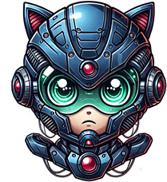

# Megaman API

## Este projeto

Este projeto é uma API desenvolvida em .NET Core 3.1 que fornece dados sobre os bosses de Megaman. O objetivo principal é servir como um backend que retorna informações no formato JSON, como no exemplo abaixo:

```json
{
  "Id": 1,
  "Code": "DLN/DRN-003",
  "Name": "Cutman",
  "HP": 150,
  "Picture": "https://vignette.wikia.nocookie.net/megaman/images/2/22/Cutman.png"
}
```

## 👋 Especificações do Projeto

O projeto foi desenvolvido utilizando as seguintes tecnologias e dependências:

- **.NET Core 3.1**: Framework principal para desenvolvimento da API.
- **Entity Framework Core**: Utilizado para mapeamento e acesso ao banco de dados.
- **Newtonsoft.Json**: Biblioteca para manipulação de JSON.
- **SQL Server**: Banco de dados utilizado para armazenamento dos dados.

O arquivo `.csproj` do projeto contém as seguintes dependências:

```xml
<Project Sdk="Microsoft.NET.Sdk.Web">
  <PropertyGroup>
    <TargetFramework>netcoreapp3.1</TargetFramework>
  </PropertyGroup>

  <ItemGroup>
    <PackageReference Include="Microsoft.EntityFrameworkCore" Version="3.1.8" />
    <PackageReference Include="Microsoft.EntityFrameworkCore.Design" Version="3.1.8">
      <IncludeAssets>runtime; build; native; contentfiles; analyzers; buildtransitive</IncludeAssets>
      <PrivateAssets>all</PrivateAssets>
    </PackageReference>
    <PackageReference Include="Microsoft.EntityFrameworkCore.SqlServer" Version="3.1.8" />
    <PackageReference Include="Newtonsoft.Json" Version="12.0.2" />
  </ItemGroup>
</Project>
```

## 🚀 Endpoints da API

A API possui os seguintes endpoints:

### 1. Listar todos os robôs

- **Método**: `GET`
- **Rota**: `/api/v1/robots`
- **Descrição**: Retorna uma lista de todos os robôs cadastrados.
- **Exemplo de Resposta**:

```json
[
  {
    "Id": 1,
    "Code": "DLN/DRN-003",
    "Name": "Cutman",
    "HP": 150,
    "Picture": "https://vignette.wikia.nocookie.net/megaman/images/2/22/Cutman.png"
  }
]
```

### 2. Buscar robô por ID

- **Método**: `GET`
- **Rota**: `/api/v1/robots/{id}`
- **Descrição**: Retorna os detalhes de um robô específico com base no ID.
- **Exemplo de Resposta**:

```json
{
  "Id": 1,
  "Code": "DLN/DRN-003",
  "Name": "Cutman",
  "HP": 150,
  "Picture": "https://vignette.wikia.nocookie.net/megaman/images/2/22/Cutman.png"
}
```

### 3. Enviar robô (Placeholder)

- **Método**: `POST`
- **Rota**: `/api/v1/robots`
- **Descrição**: Endpoint de exemplo para envio de dados (ainda não implementado).

## 🗂 Estrutura do Projeto

```
├── 📂 .vs
│   └── 📂 MegamanApi
│       └── 📂 v15
│           └── 📄 .suo
├── 📂 .vscode
│   ├── 📄 launch.json
│   └── 📄 tasks.json
├── 📂 Controllers
│   └── 📄 RobotsController.cs
├── 📂 Database
│   ├── 📂 DTOs
│   │   └── 📂 Robots
│   │       ├── 📄 RobotCreateDTO.cs
│   │       └── 📄 RobotReadDTO.cs
│   ├── 📂 EntityFramework
│   │   ├── 📂 Context
│   │   │   └── 📄 RobotsContext.cs
│   │   └── 📂 Migrations
│   │       ├── 📄 20201010003954_InitialMigration.cs
│   │       ├── 📄 20201010003954_InitialMigration.Designer.cs
│   │       └── 📄 RobotsContextModelSnapshot.cs
│   └── 📂 Repositories
│       └── 📂 Robots
│           ├── 📄 IRobotRepository.cs
│           ├── 📄 MockRobotRepository.cs
│           └── 📄 SqlRobotRepository.cs
├── 📂 middlewares
│   ├── 📄 MiddlewareLog.cs
│   └── 📄 MiddlewareLogExtesions.cs
├── 📂 Models
│   └── 📄 Robot.cs
├── 📂 Services
│   └── 📂 Robots
│       ├── 📄 IRobotServices.cs
│       └── 📄 RobotServices.cs
├── 📄 appsettings.Development.json
├── 📄 appsettings.json
├── 📄 global.json
├── 📄 MegamanApi.csproj
├── 📄 MegamanApi.sln
├── 📄 Program.cs
└── 📄 Startup.cs
```

## 🛠 Técnicas Utilizadas

- **Injeção de Dependência**: Utilizada para desacoplar as dependências e facilitar testes e manutenção.
- **Entity Framework Core**: Para mapeamento e persistência dos dados no banco de dados SQL Server.
- **DTOs (Data Transfer Objects)**: Utilizados para transferência de dados entre as camadas da aplicação.
- **Middlewares**: Implementados para adicionar funcionalidades globais, como logs e tratamento de erros.
- **Newtonsoft.Json**: Para serialização e desserialização de objetos JSON.

## 📝 Como Executar o Projeto

Clone o repositório:

```bash
git clone https://github.com/seu-usuario/megaman-api.git
```

Navegue até a pasta do projeto:

```bash
cd megaman-api
```

Restaure as dependências:

```bash
dotnet restore
```

Execute o projeto:

```bash
dotnet run
```

Acesse a API em [http://localhost:5000/api/v1/robots](http://localhost:5000/api/v1/robots).

## 📄 Licença

Este projeto está sob a licença MIT. Consulte o arquivo LICENSE para mais detalhes.

---

👨‍💻 Feito por [André Sousa](https://github.com/andrelssousa).
